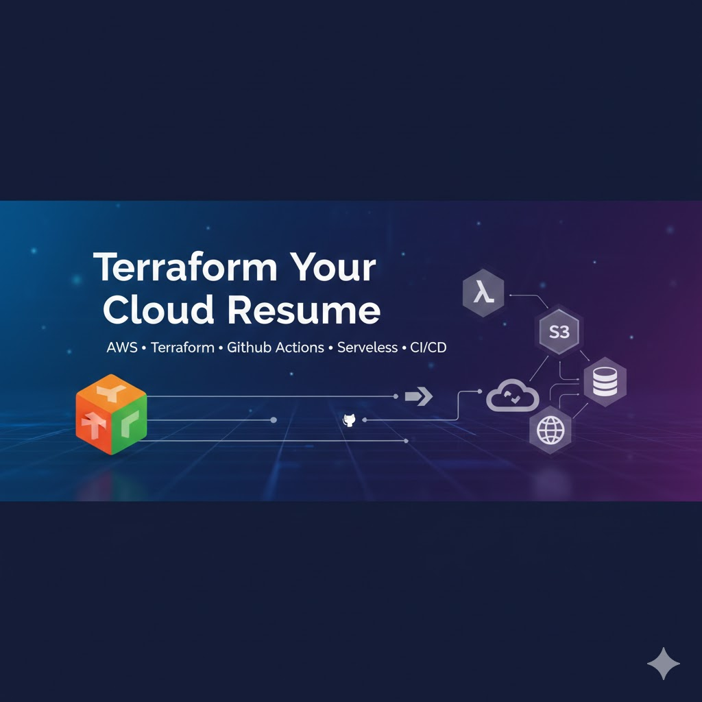
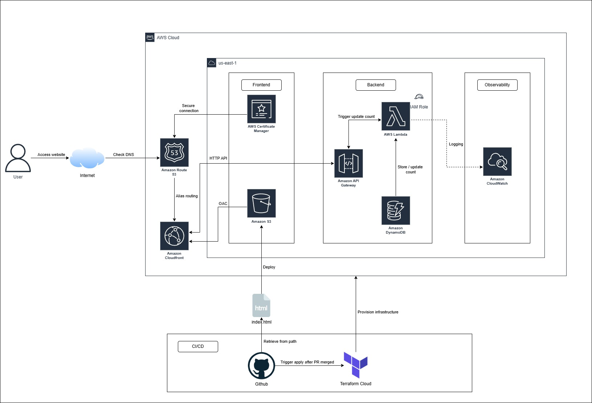
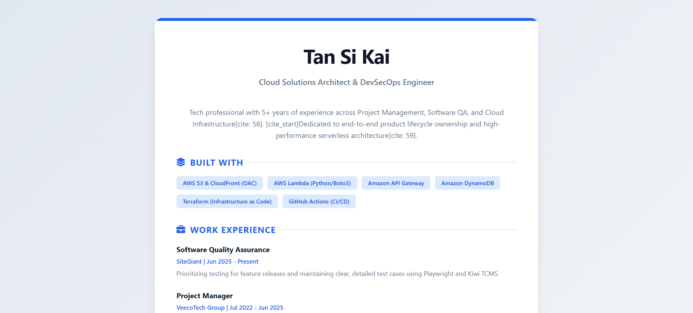
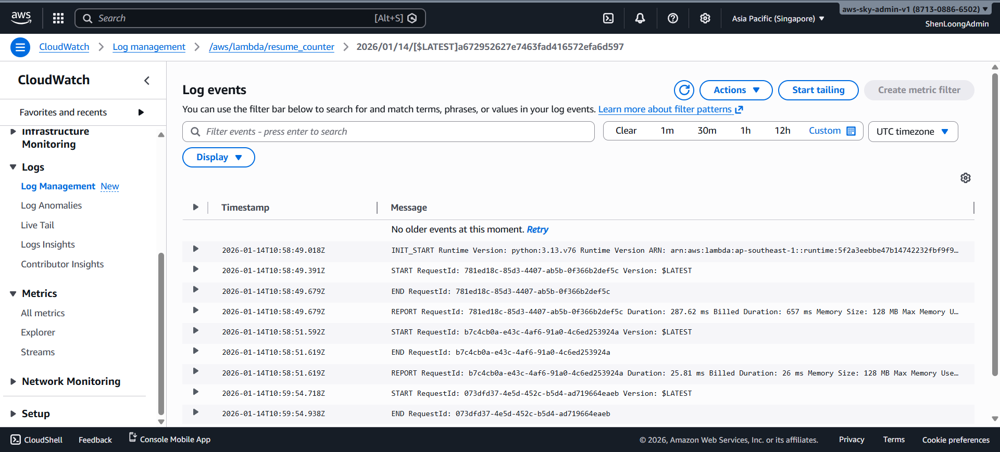
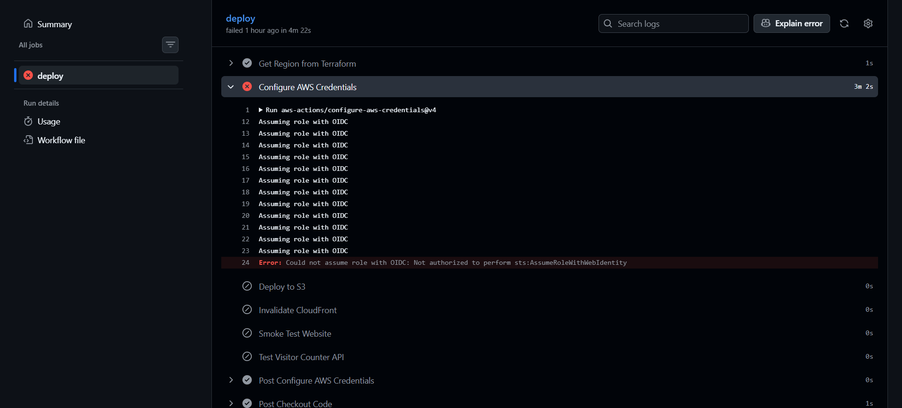
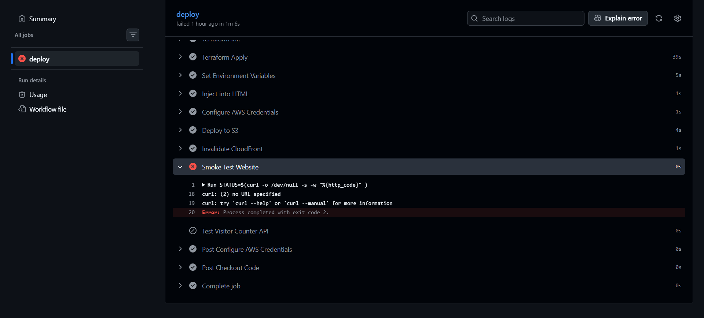

[![Contributors][contributors-shield]][contributors-url]
[![Forks][forks-shield]][forks-url]
[![Stargazers][stars-shield]][stars-url]
[![Issues][issues-shield]][issues-url]
[![Unlicense License][license-shield]][license-url]
[![LinkedIn][linkedin-shield]][linkedin-url]

   <h1>☁️ AWS Cloud Resume Challenge</h1>
   
   
A production-grade, serverless resume website built with <strong>Terraform</strong>, <strong>AWS</strong>, and <strong>GitHub Actions</strong>

 

 
[![Infrastructure CI][ci-shield]][ci-url]
[![Production Deployment][cd-shield]][cd-url]
[![Update Documentation][docs-shield]][docs-url]

 

<a href="#about-the-project"><strong>Explore the docs »</strong></a>

   
Table of Contents

   <ol>
      <li><a href="#about-the-project">About The Project</a></li>
      <li><a href="#built-with">Built With</a></li>
      <li><a href="#use-cases">Use Cases</a></li>
      <li><a href="#architecture">Architecture</a></li>
      <li><a href="#file-structure">File Structure</a></li>
      <li><a href="#technical">Technical Reference</a></li>
      <li><a href="#getting-started">Getting Started</a></li>
      <li><a href="#gitops">GitOps & CI/CD Workflow</a></li>
      <li><a href="#usage">Usage</a></li>
      <li><a href="#roadmap">Roadmap</a></li>
      <li><a href="#challenges-faced">Challenges</a></li>
      <li><a href="#cost-optimization">Cost Optimization</a></li>
      <li><a href="#special-thanks">Special Thanks</a></li>
   </ol>

<h2 id="about-the-project">About The Project</h2>

This project represents the successful completion of the <strong>Cloud Resume Challenge</strong>. It transitions my professional profile from a static document into a high-availability, globally distributed web application. The core objective was to demonstrate full-stack cloud proficiency by automating the deployment of both infrastructure (IaC) and application code through a secure CI/CD pipeline.

<a href="#readme-top">↑ Back to Top</a>

<h2 id="built-with">Built With</h2>

    
    
    
    
    
    
    
    
    

<ul>
   <li><strong>Terraform Cloud</strong> – Remote state management and automated IaC execution.</li>
   <li><strong>Amazon S3 & CloudFront (OAC)</strong> – Secure static web hosting with Origin Access Control.</li>
   <li><strong>AWS Lambda & API Gateway</strong> – Serverless backend for the visitor counter.</li>
   <li><strong>Amazon DynamoDB</strong> – NoSQL database for stateful counter persistence.</li>
   <li><strong>GitHub Actions</strong> – CI/CD pipeline featuring OIDC for keyless AWS authentication.</li>
</ul>

<a href="#readme-top">↑ Back to Top</a>

<h2 id="use-cases">Use Cases</h2>
<ul>
   <li><strong>Professional Branding:</strong> Showcases my technical evolution from QA and Project Management into Cloud Infrastructure.</li>
   <li><strong>Security Demonstration:</strong> Implements OIDC and least-privilege IAM roles, eliminating the need for long-lived AWS keys in GitHub Secrets.</li>
   <li><strong>Automated Synchronization:</strong> Uses dynamic <code>sed</code> injection to ensure the frontend always targets the correct backend API endpoint after every infrastructure update.</li>
</ul>

<a href="#readme-top">↑ Back to Top</a>

<h2 id="architecture">Architecture</h2>

The architecture follows a modern decoupled serverless flow:<code>User Browser</code> ➔ <code>CloudFront (HTTPS)</code> ➔ <code>S3 (Static Assets)</code><code>Frontend JS</code> ➔ <code>API Gateway</code> ➔ <code>Lambda</code> ➔ <code>DynamoDB (Atomic Update)</code>

<a href="#readme-top">↑ Back to Top</a>

<h2 id="file-structure">File Structure</h2>
<pre>.
├── .github/
│   └── workflows/           # CI/CD Pipeline Definitions
│       ├── cd.yml           # Continuous Deployment
│       ├── ci.yml           # Continuous Integration
│       └── update-readme.yml # Automated README Sync
├── .terraform/              # Local Terraform managed files
├── assets/                  # Documentation images and media
├── lambda/                  # Serverless backend logic
│   ├── func.py              # Lambda Python source code
│   └── func.zip             # Compiled deployment artifact
├── website-files/           # Frontend static assets
│   └── index.html           # Resume UI
├── .gitignore               # Excluded files from Git
├── .terraform.lock.hcl      # Provider lock file
├── acm.tf                   # SSL/TLS Certificate configuration
├── api_gateway.tf           # REST API endpoint configuration
├── cloudfront.tf            # CDN distribution settings
├── database.tf              # DynamoDB table configuration
├── lambda.tf                # Lambda compute resource settings
├── main.tf                  # Core infrastructure definitions
├── outputs.tf               # Resource endpoints and IDs
├── providers.tf             # AWS and Terraform backend configuration
├── README.md                # Generated documentation
├── README.template.md       # Documentation source template
├── route53.tf               # DNS management
├── s3.tf                    # Static asset storage
├── terraform.tfstate        # Local state file (if not using cloud)
├── terraform.tfstate.backup # Previous state snapshot
├── .pre-commit-config.yaml  # Local git-hook orchestration
├── .tflint.hcl              # TFLint AWS ruleset configuration
├── .checkov.yml             # Checkov scan ignore list
└── variables.tf             # Input parameters and configurations
</pre>

<a href="#readme-top">↑ Back to Top</a>

<h2 id="technical">Technical Reference</h2>
This section is automatically updated with the latest infrastructure details.

<b>Detailed Infrastructure Specifications</b>

<!-- BEGIN_TF_DOCS -->

## Requirements

| Name                                                                     | Version  |
| ------------------------------------------------------------------------ | -------- |
|  [terraform](#requirement_terraform) | >= 1.5.0 |
|  [archive](#requirement_archive)       | ~> 2.0   |
|  [aws](#requirement_aws)                   | ~> 5.0   |
|  [random](#requirement_random)          | ~> 3.0   |

## Providers

| Name                                                         | Version |
| ------------------------------------------------------------ | ------- |
|  [archive](#provider_archive) | 2.7.1   |
|  [aws](#provider_aws)             | 5.100.0 |
|  [random](#provider_random)    | 3.8.0   |

## Modules

No modules.

## Resources

| Name                                                                                                                                                                                               | Type        |
| -------------------------------------------------------------------------------------------------------------------------------------------------------------------------------------------------- | ----------- |
| [aws_apigatewayv2_api.resume_api_gw](https://registry.terraform.io/providers/hashicorp/aws/latest/docs/resources/apigatewayv2_api)                                                                 | resource    |
| [aws_apigatewayv2_integration.lambda_integration](https://registry.terraform.io/providers/hashicorp/aws/latest/docs/resources/apigatewayv2_integration)                                            | resource    |
| [aws_apigatewayv2_route.api_route](https://registry.terraform.io/providers/hashicorp/aws/latest/docs/resources/apigatewayv2_route)                                                                 | resource    |
| [aws_apigatewayv2_stage.api_stage](https://registry.terraform.io/providers/hashicorp/aws/latest/docs/resources/apigatewayv2_stage)                                                                 | resource    |
| [aws_cloudfront_distribution.s3_distribution](https://registry.terraform.io/providers/hashicorp/aws/latest/docs/resources/cloudfront_distribution)                                                 | resource    |
| [aws_cloudfront_origin_access_control.resume_oac](https://registry.terraform.io/providers/hashicorp/aws/latest/docs/resources/cloudfront_origin_access_control)                                    | resource    |
| [aws_cloudwatch_log_group.lambda_log_group](https://registry.terraform.io/providers/hashicorp/aws/latest/docs/resources/cloudwatch_log_group)                                                      | resource    |
| [aws_dynamodb_table.visitor_count](https://registry.terraform.io/providers/hashicorp/aws/latest/docs/resources/dynamodb_table)                                                                     | resource    |
| [aws_iam_role.lambda_role](https://registry.terraform.io/providers/hashicorp/aws/latest/docs/resources/iam_role)                                                                                   | resource    |
| [aws_iam_role_policy.lambda_db_policy](https://registry.terraform.io/providers/hashicorp/aws/latest/docs/resources/iam_role_policy)                                                                | resource    |
| [aws_iam_role_policy_attachment.lambda_logs](https://registry.terraform.io/providers/hashicorp/aws/latest/docs/resources/iam_role_policy_attachment)                                               | resource    |
| [aws_lambda_function.resume_api](https://registry.terraform.io/providers/hashicorp/aws/latest/docs/resources/lambda_function)                                                                      | resource    |
| [aws_lambda_permission.api_gw_lambda](https://registry.terraform.io/providers/hashicorp/aws/latest/docs/resources/lambda_permission)                                                               | resource    |
| [aws_s3_bucket.resume_bucket](https://registry.terraform.io/providers/hashicorp/aws/latest/docs/resources/s3_bucket)                                                                               | resource    |
| [aws_s3_bucket_lifecycle_configuration.resume_lifecycle](https://registry.terraform.io/providers/hashicorp/aws/latest/docs/resources/s3_bucket_lifecycle_configuration)                            | resource    |
| [aws_s3_bucket_policy.allow_access_from_cloudfront](https://registry.terraform.io/providers/hashicorp/aws/latest/docs/resources/s3_bucket_policy)                                                  | resource    |
| [aws_s3_bucket_public_access_block.resume_block](https://registry.terraform.io/providers/hashicorp/aws/latest/docs/resources/s3_bucket_public_access_block)                                        | resource    |
| [aws_s3_bucket_server_side_encryption_configuration.resume_encryption](https://registry.terraform.io/providers/hashicorp/aws/latest/docs/resources/s3_bucket_server_side_encryption_configuration) | resource    |
| [aws_s3_bucket_versioning.resume_versioning](https://registry.terraform.io/providers/hashicorp/aws/latest/docs/resources/s3_bucket_versioning)                                                     | resource    |
| [random_string.bucket_suffix](https://registry.terraform.io/providers/hashicorp/random/latest/docs/resources/string)                                                                               | resource    |
| [archive_file.lambda_zip](https://registry.terraform.io/providers/hashicorp/archive/latest/docs/data-sources/file)                                                                                 | data source |

## Inputs

| Name                                                                  | Description         | Type     | Default            | Required |
| --------------------------------------------------------------------- | ------------------- | -------- | ------------------ | :------: |
|  [aws_region](#input_aws_region)       | AWS region          | `string` | `"ap-southeast-1"` |    no    |
|  [project_name](#input_project_name) | Project name prefix | `string` | `"cloud-resume"`   |    no    |

## Outputs

| Name                                                                                      | Description                                 |
| ----------------------------------------------------------------------------------------- | ------------------------------------------- |
|  [api_url](#output_api_url)                                  | The URL of the API Gateway                  |
|  [aws_region](#output_aws_region)                         | The AWS region where resources are deployed |
|  [cloudfront_dist_id](#output_cloudfront_dist_id) | The ID of the CloudFront distribution       |
|  [lambda_arn](#output_lambda_arn)                         | The ARN of the Lambda function              |
|  [website_bucket_id](#output_website_bucket_id)    | The name of the S3 bucket                   |
|  [website_url](#output_website_url)                      | The URL of the CloudFront distribution      |

<!-- END_TF_DOCS -->

<a href="#readme-top">↑ Back to Top</a>

<h2 id="getting-started">Getting Started</h2>
<h3>Prerequisites</h3>
<ul>
   <li>AWS Account with an active IAM role for OIDC.</li>
   <li>Terraform Cloud Organization and Workspace.</li>
   <li>GitHub Repository with <code>EMAIL_ADDRESS</code> and <code>TF_API_TOKEN</code> secrets.</li>
   <li><strong>Set your AWS Region:</strong> Set to whatever <code>aws_region</code> you want in <code>variables.tf</code>.</li>
</ul>

<h3>Terraform Cloud State Management</h3>
<ol>
   <li>Create a new <strong>Workspace</strong> with github version control workflow in Terraform Cloud.</li>
   <li>In the Variables tab, add the following <strong>Terraform Variables:</strong>
   </li>
   <li>
    Add the following <strong>Environment Variables</strong> (AWS Credentials):
    <ul>
      <li><code>AWS_ACCESS_KEY_ID</code></li>
      <li><code>AWS_SECRET_ACCESS_KEY</code></li>
   </ul>
   </li>
    <li>
      Run the command ni Terraform CLI:
      <pre>terraform login</pre>
    </li>
    <li>Create a token and follow the steps in browser to complete the Terraform Cloud Connection.</li>
    <li>
      Add the <code>backend</code> block in <code>terraform</code> code block</code>:
    <pre>backend "remote" {
  hostname     = "app.terraform.io"
  organization = &lt;your-organization-name&gt;
  workspaces {
    name = &lt;your-workspace-name&gt;
  }
}</pre>
   </li>
    <li>
      Run the command in Terraform CLI to migrate the state into Terraform Cloud:
      <pre>terraform init -migrate-state</pre>
    </li>
</ol>

<h3>Installation & Deployment</h3>
<ol>
    <li>
        <strong>Clone the Repository:</strong>
        <pre>git clone https://github.com/ShenLoong99/aws-terraform-cloud-resume-iac-challenge.git</pre>
    </li>
    <li>
        <strong>Provision Infrastructure:</strong> 
        <strong>Terraform Cloud</strong> → <strong>Initialize & Apply:</strong> Push your code to GitHub. Terraform Cloud will automatically detect the change, run a <code>plan</code>, and wait for your approval.
    </li>
    <li>
        <strong>Observe workflow:</strong> 
        <strong>GitHub (GitOps)</strong> → <strong>Github actions:</strong> Observe the process/workflow of CI/CD in the actions tab in GitHub.
    </li>
</ol>

<a href="#readme-top">↑ Back to Top</a>

<h2 id="gitops">GitOps & CI/CD Workflow</h2>

This project uses a fully automated GitOps pipeline to ensure code quality and deployment reliability. The <strong>Pre-commit</strong> framework implements a "Shift-Left" strategy, ensuring that code is formatted, documented, and secure before it ever leaves your machine.

<h3>Workflow Files</h3>
<ol>
  <li>
    <strong>Pre-commit</strong>
    <ul>
      <li><strong>Tool:</strong> Executes <code>terraform fmt</code>, <code>terraform validate</code>, <code>TFLint</code>, <code>terraform_docs</code> and <code>checkov</code> to ensure the code is clean.</li>
      <li><strong>Trigger:</strong> Runs on every <strong>git commit</strong>.</li>
      <li>
        <strong>Outcome:</strong> If any check fails, the commit is blocked. You fix the error, re-add the file, and commit again.
      </li>
    </ul>
  </li>
  <li>
    <strong>Continuous Integration (PR)</strong>
    <ul>
      <li><strong>Tool:</strong> Executes <code>terraform fmt -check</code>, <code>terraform validate</code> and <code>checkov</code>, then do <code>plan</code> and cost estimation and print it on PR.</li>
      <li><strong>Trigger:</strong> Runs on every <strong>Pull Request</strong>.</li>
      <li>
        <strong>Outcome:</strong> This acts as the "Gatekeeper" before code is merged to <code>main</code>.
      </li>
    </ul>
  </li>
  <li>
    <strong>Continuous Delivery (Deployment)</strong>
    <ul>
      <li><strong>Tool:</strong> Terraform Cloud + GitHub Actions OIDC.</li>
      <li><strong>Trigger:</strong> Merges to the <code>main</code> branch.</li>
      <li>
        <strong>Outcome:</strong> The pipeline verifies the infrastructure state and runs a post-deployment health check with(<code>health-check.sh</code> & <code>smoke-test-website.sh</code>).
      </li>
    </ul>
  </li>
  <li>
    <strong>Dynamically update readme documentation</strong>
    <ul>
      <li><strong>Tool:</strong> Terraform Cloud + GitHub Actions.</li>
      <li><strong>Trigger:</strong> Merges to the <code>main</code> branch.</li>
      <li>
        <strong>Outcome:</strong> The pipeline verifies the infrastructure state from Terraform Cloud, retrieve outputs from Terraform Cloud and update the readme documentation file dynamically.
      </li>
    </ul>
  </li>
</ol>

<h3>Prerequisites for GitOps</h3>
<ul>
  <li><strong>Repository Secret <code>TF_API_TOKEN</code>:</strong> Required for GitHub to communicate with Terraform Cloud.</li>
  <li><strong>Trigger:</strong> A GitHub Actions OIDC role (<code>GitHubActionRole</code>) allows the runner to verify AWS resources without long-lived keys.</li>
</ul>

<h2 id="usage">Usage</h2>

 Once deployed, the project provides two live interfaces: 

<ul>
   <li>
    <strong>Resume Website:</strong> Accessible via the <code>website_url</code> (CloudFront Domain). 
    
    </li>
   <li><strong>Visitor API:</strong> Testable via <code>curl</code> using the <code>api_url</code> output.</li>
</ul>

<h3 id="monitoring">📊 Monitoring & Observability</h3>

  The backend performance and reliability are monitored using <strong>Amazon CloudWatch</strong>. This ensures high availability for the visitor counter and provides insights into the execution health of the serverless stack.

<ul>
  <li><strong>Execution Logs:</strong> Every Lambda invocation is recorded in CloudWatch Logs for real-time debugging.</li>
  <li><strong>Metrics Tracking:</strong> Monitors invocation counts, error rates, and execution duration (latency).</li>
  <li><strong>Cost Optimization:</strong> Log retention is set to <strong>7 days</strong> via Terraform to minimize storage costs while maintaining sufficient history for troubleshooting.</li>
</ul>

<a href="#readme-top">↑ Back to Top</a>

<h2 id="roadmap">Roadmap</h2>
<ul>
   <li>[x] <strong>Static Site:</strong> S3 Bucket + CloudFront Distribution.</li>
   <li>[x] <strong>Serverless Backend:</strong> Lambda function with DynamoDB integration.</li>
   <li>[x] <strong>Infrastructure as Code:</strong> Full resource management via Terraform.</li>
   <li>[x] <strong>Automation:</strong> GitHub Actions pipeline with smoke testing.</li>
   <li>[ ] <strong>Custom Domain:</strong> (Optional) Route 53 and ACM Certificate integration.</li>
</ul>

<a href="#readme-top">↑ Back to Top</a>

<h2 id="challenges-faced">Challenges Faced</h2>
<table>
   <thead>
      <tr>
         <th>Challenge</th>
         <th>Solution</th>
      </tr>
   </thead>
   <tbody>
      <tr>
         <td><strong>OIDC Trust Policy Mismatch</strong></td>
         <td>
            Refined the IAM Trust Relationship to explicitly include the GitHub <code>environment: prod</code> claim. 
            
        </td>
      </tr>
      <tr>
         <td><strong>Dynamic API Endpoints</strong></td>
         <td>
            Implemented <code>sed</code>-based injection in the CI/CD pipeline to patch <code>index.html</code> with Terraform outputs in real-time.
        </td>
      </tr>
      <tr>
         <td><strong>API Smoke Test Failures</strong></td>
         <td>
            Corrected endpoint paths in the test scripts to align with Terraform's <code>api_endpoint</code> structure. 
            
        </td>
      </tr>
   </tbody>
</table>

<h3 id="technical-challenges">🧠 Technical Challenges & Lessons Learned</h3>

    During the development of the automated documentation pipeline, I explored several advanced GitOps strategies to allow the GitHub Actions bot to update the README while maintaining strict branch protection on <code>main</code>.

I evaluated the following industry-standard patterns:

<ul>
    <li><strong>Option 1: Grant Bypass Permissions (Bot Actor):</strong> Attempted to grant the <code>github-actions</code> bot specific bypass rights to push directly to <code>main</code> without a PR.</li>
    <li><strong>Option 2: Automated Pull Requests:</strong> Implementing a workflow where the bot opens a PR for every doc change to satisfy the "Require PR" rule.</li>
    <li><strong>Option 3: Custom Administrative PAT:</strong> Using a Personal Access Token with elevated scopes to override protection hooks.</li>
</ul>

    <strong>The Hurdle:</strong> These implementations were ultimately deprioritized because <strong>GitHub Free</strong> tier (for personal accounts) limits the "Bypass Pull Request" functionality for specific actors. Furthermore, creating a chain of dependencies (Bot PR -> Automated Merge -> Deployment) added significant complexity that was not cost-effective for a single-developer resume project.

    <strong>The Solution:</strong> I opted for a cleaner, more sustainable approach by implementing Path Filtering. This ensures the documentation workflow only triggers when essential template or infrastructure files change, minimizing the need for constant bypasses while keeping the repository's security posture intact

<a href="#readme-top">↑ Back to Top</a>

<h2 id="cost-optimization">Cost Optimization</h2>
<ul>
   <li><strong>AWS Free Tier:</strong> Utilizes S3, CloudFront, Lambda, and DynamoDB (On-Demand) to maintain <strong>$0/month</strong> operating costs.</li>
   <li><strong>CloudFront OAC:</strong> Securely serves content without public S3 bucket access, reducing potential data egress abuse.</li>
   <li><strong>Lambda Resource Tuning:</strong> Minimal memory allocation (128MB) ensures high performance for simple atomic counter increments.</li>
</ul>

<a href="#readme-top">↑ Back to Top</a>

<h2 id="special-thanks">⭐ Special Thanks</h2>

  
This project was built as part of the <strong>Cloud Resume Challenge</strong>. A special thanks to the creators and community for providing the framework to bridge the gap between theory and practice.

  <table>
    <tr>
      <td align="center">
        <a href="https://cloudresumechallenge.dev/docs/extensions/terraform-getting-started/">
          
           
          <b>Terraform Your Cloud Resume</b>
        </a>
      </td>
      <td align="center">
        <a href="https://github.com/cloudresumechallenge/projects/blob/main/projects/terraform/getting-started.md">
          
           
          <b>View Project Specs</b>
        </a>
      </td>
      <td align="center">
        <a href="https://cloudresumechallenge.dev/">
          
           
          <b>Cloud Resume Challenge</b>
        </a>
      </td>
    </tr>
  </table>

<a href="#readme-top">↑ Back to Top</a>

[contributors-shield]: https://img.shields.io/github/contributors/ShenLoong99/aws-terraform-cloud-resume-iac-challenge.svg?style=for-the-badge
[contributors-url]: https://github.com/ShenLoong99/aws-terraform-cloud-resume-iac-challenge/graphs/contributors
[forks-shield]: https://img.shields.io/github/forks/ShenLoong99/aws-terraform-cloud-resume-iac-challenge.svg?style=for-the-badge
[forks-url]: https://github.com/ShenLoong99/aws-terraform-cloud-resume-iac-challenge/network/members
[stars-shield]: https://img.shields.io/github/stars/ShenLoong99/aws-terraform-cloud-resume-iac-challenge.svg?style=for-the-badge
[stars-url]: https://github.com/ShenLoong99/aws-terraform-cloud-resume-iac-challenge/stargazers
[issues-shield]: https://img.shields.io/github/issues/ShenLoong99/aws-terraform-cloud-resume-iac-challenge.svg?style=for-the-badge
[issues-url]: https://github.com/ShenLoong99/aws-terraform-cloud-resume-iac-challenge/issues
[license-shield]: https://img.shields.io/github/license/ShenLoong99/aws-terraform-cloud-resume-iac-challenge.svg?style=for-the-badge
[license-url]: https://github.com/ShenLoong99/aws-terraform-cloud-resume-iac-challenge/blob/master/LICENSE.txt
[linkedin-shield]: https://img.shields.io/badge/-LinkedIn-black.svg?style=for-the-badge&logo=linkedin&colorB=555
[linkedin-url]: {{LINKEDIN_URL}}
[ci-shield]: https://github.com/ShenLoong99/aws-terraform-cloud-resume-iac-challenge/actions/workflows/ci.yml/badge.svg
[ci-url]: https://github.com/ShenLoong99/aws-terraform-cloud-resume-iac-challenge/actions/workflows/ci.yml
[cd-shield]: https://github.com/ShenLoong99/aws-terraform-cloud-resume-iac-challenge/actions/workflows/cd.yml/badge.svg
[cd-url]: https://github.com/ShenLoong99/aws-terraform-cloud-resume-iac-challenge/actions/workflows/cd.yml
[docs-shield]: https://github.com/ShenLoong99/aws-terraform-cloud-resume-iac-challenge/actions/workflows/update-readme.yml/badge.svg
[docs-url]: https://github.com/ShenLoong99/aws-terraform-cloud-resume-iac-challenge/actions/workflows/update-readme.yml
