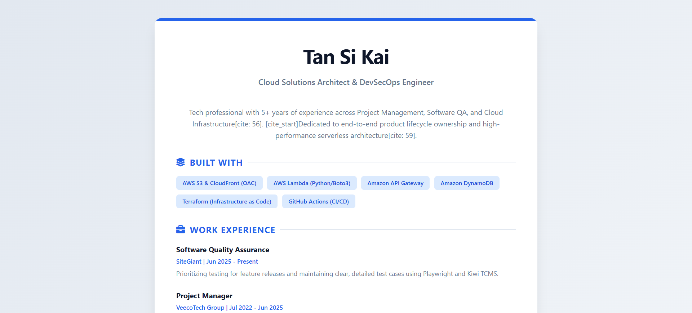
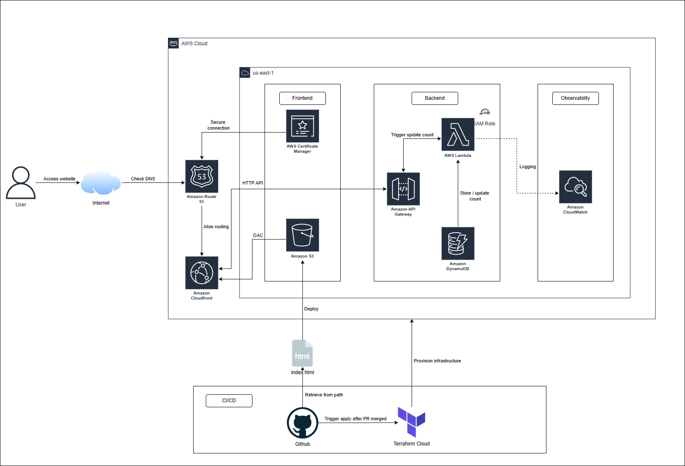
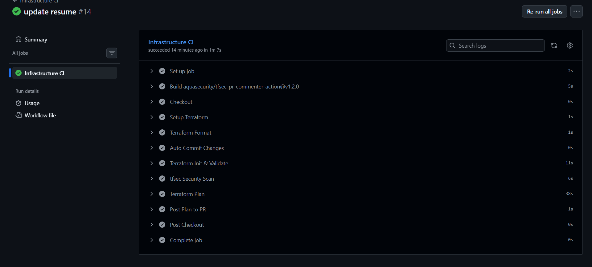
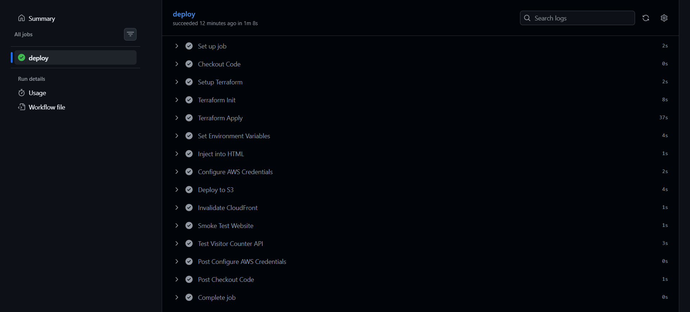
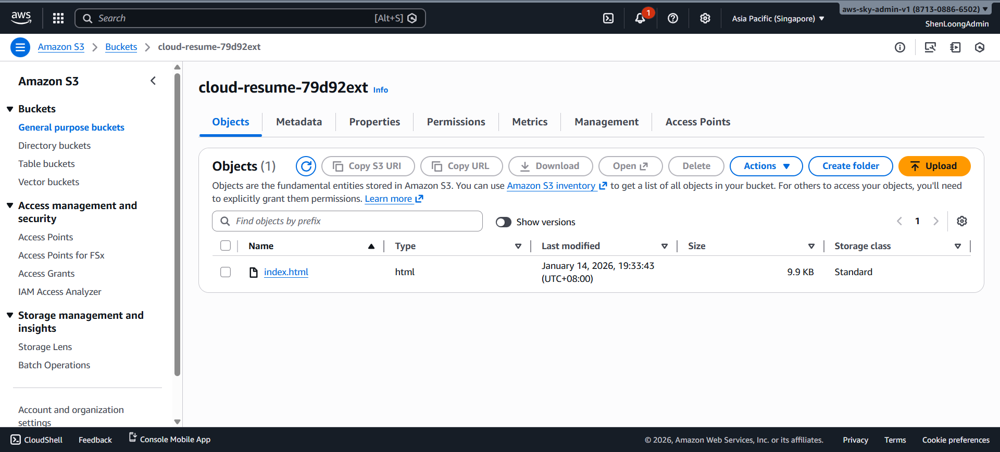
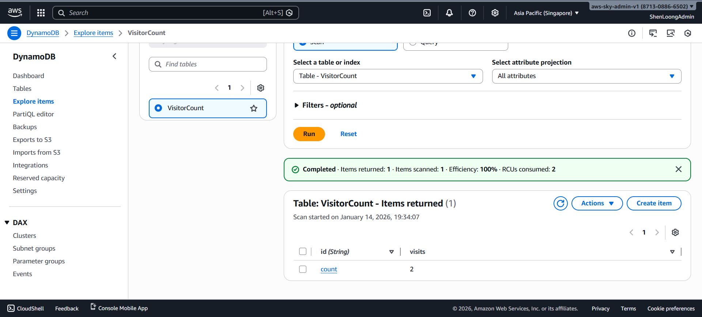
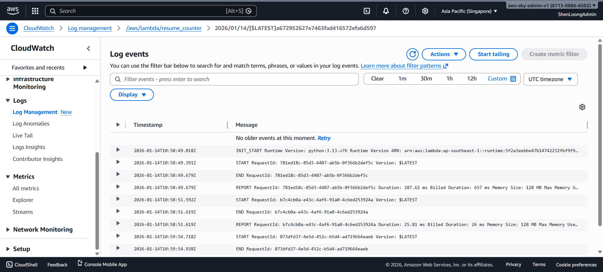
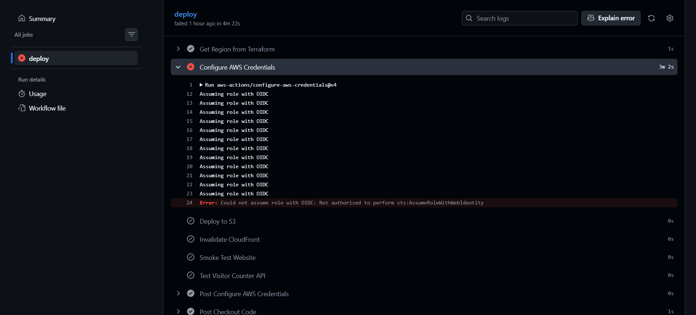
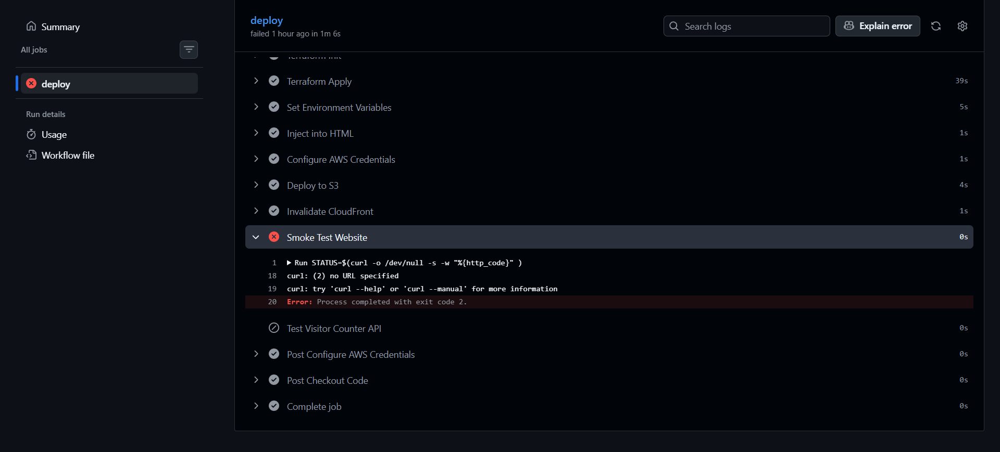

[![Contributors][contributors-shield]][contributors-url]
[![Forks][forks-shield]][forks-url]
[![Stargazers][stars-shield]][stars-url]
[![Issues][issues-shield]][issues-url]
[![Unlicense License][license-shield]][license-url]
[![LinkedIn][linkedin-shield]][linkedin-url]

   <h1>☁️ AWS Cloud Resume Challenge</h1>
   
   
A production-grade, serverless resume website built with <strong>Terraform</strong>, <strong>AWS</strong>, and <strong>GitHub Actions</strong>. <a href="#about-the-project"><strong>Explore the docs »</strong></a>

   
Table of Contents

   <ol>
      <li><a href="#about-the-project">About The Project</a></li>
      <li><a href="#built-with">Built With</a></li>
      <li><a href="#use-cases">Use Cases</a></li>
      <li><a href="#architecture">Architecture</a></li>
      <li><a href="#file-structure">File Structure</a></li>
      <li><a href="#getting-started">Getting Started</a></li>
      <li><a href="#usage">Usage</a></li>
      <li><a href="#roadmap">Roadmap</a></li>
      <li><a href="#challenges-faced">Challenges</a></li>
      <li><a href="#cost-optimization">Cost Optimization</a></li>
   </ol>

<h2 id="about-the-project">About The Project</h2>

This project represents the successful completion of the <strong>Cloud Resume Challenge</strong>. It transitions my professional profile from a static document into a high-availability, globally distributed web application. The core objective was to demonstrate full-stack cloud proficiency by automating the deployment of both infrastructure (IaC) and application code through a secure CI/CD pipeline.

<a href="#readme-top">↑ Back to Top</a>

<h2 id="built-with">Built With</h2>

    
    
    
    
    
    
    
    
    

<ul>
   <li><strong>Terraform Cloud</strong> – Remote state management and automated IaC execution.</li>
   <li><strong>Amazon S3 & CloudFront (OAC)</strong> – Secure static web hosting with Origin Access Control.</li>
   <li><strong>AWS Lambda & API Gateway</strong> – Serverless backend for the visitor counter.</li>
   <li><strong>Amazon DynamoDB</strong> – NoSQL database for stateful counter persistence.</li>
   <li><strong>GitHub Actions</strong> – CI/CD pipeline featuring OIDC for keyless AWS authentication.</li>
</ul>

<a href="#readme-top">↑ Back to Top</a>

<h2 id="use-cases">Use Cases</h2>
<ul>
   <li><strong>Professional Branding:</strong> Showcases my technical evolution from QA and Project Management into Cloud Infrastructure.</li>
   <li><strong>Security Demonstration:</strong> Implements OIDC and least-privilege IAM roles, eliminating the need for long-lived AWS keys in GitHub Secrets.</li>
   <li><strong>Automated Synchronization:</strong> Uses dynamic <code>sed</code> injection to ensure the frontend always targets the correct backend API endpoint after every infrastructure update.</li>
</ul>

<a href="#readme-top">↑ Back to Top</a>

<h2 id="architecture">Architecture</h2>

The architecture follows a modern decoupled serverless flow:<code>User Browser</code> ➔ <code>CloudFront (HTTPS)</code> ➔ <code>S3 (Static Assets)</code><code>Frontend JS</code> ➔ <code>API Gateway</code> ➔ <code>Lambda</code> ➔ <code>DynamoDB (Atomic Update)</code>

<a href="#readme-top">↑ Back to Top</a>

<h2 id="file-structure">File Structure</h2>
<pre>.
├── .github/
│   └── workflows/           # CI/CD Pipeline Definitions
│       ├── cd.yml           # Continuous Deployment
│       ├── ci.yml           # Continuous Integration
│       └── update-readme.yml # Automated README Sync
├── .terraform/              # Local Terraform managed files
├── assets/                  # Documentation images and media
├── lambda/                  # Serverless backend logic
│   ├── func.py              # Lambda Python source code
│   └── func.zip             # Compiled deployment artifact
├── website-files/           # Frontend static assets
│   └── index.html           # Resume UI
├── .gitignore               # Excluded files from Git
├── .terraform.lock.hcl      # Provider lock file
├── acm.tf                   # SSL/TLS Certificate configuration
├── api_gateway.tf           # REST API endpoint configuration
├── cloudfront.tf            # CDN distribution settings
├── database.tf              # DynamoDB table configuration
├── lambda.tf                # Lambda compute resource settings
├── main.tf                  # Core infrastructure definitions
├── outputs.tf               # Resource endpoints and IDs
├── providers.tf             # AWS and Terraform backend configuration
├── README.md                # Generated documentation
├── README.template.md       # Documentation source template
├── route53.tf               # DNS management
├── s3.tf                    # Static asset storage
├── terraform.tfstate        # Local state file (if not using cloud)
├── terraform.tfstate.backup # Previous state snapshot
└── variables.tf             # Input parameters and configurations
</pre>

<a href="#readme-top">↑ Back to Top</a>

<h2 id="getting-started">Getting Started</h2>
<h3>Prerequisites</h3>
<ul>
   <li>AWS Account with an active IAM role for OIDC.</li>
   <li>Terraform Cloud Organization and Workspace.</li>
   <li>GitHub Repository with <code>EMAIL_ADDRESS</code> and <code>TF_API_TOKEN</code> secrets.</li>
   <li><strong>Set your AWS Region:</strong> Set to whatever <code>aws_region</code> you want in <code>variables.tf</code>.</li>
</ul>

<h3>Terraform Cloud</h3>
<ol>
   <li>Create a new <strong>Workspace</strong> in Terraform Cloud with CLI workflow.</li>
   </li>
   <li>
    Add the following <strong>Environment Variables</strong> (AWS Credentials):
    <ul>
      <li><code>AWS_ACCESS_KEY_ID</code></li>
      <li><code>AWS_SECRET_ACCESS_KEY</code></li>
   </ul>
   </li>
   <li>
      Configure the <code>backend</code> block:
      <pre>cloud {
    organization = &lt;your-tfc-organization&gt;
    workspaces {
        name = &lt;your-tfc-workspace&gt;
    }
}</pre>
   </li>
   <li>
    Add the following <strong>Environment Variables</strong> (AWS Credentials):
    <pre>git bash command:
export AWS_ACCESS_KEY_ID=&lt;your-aws-access-key-id&gt;
export AWS_SECRET_ACCESS_KEY=&lt;your-aws-secret-access-key&gt;</pre>
   </li>
</ol>

<h3 id="cicd-setup">🚀 CI/CD & Deployment Process</h3>

This project uses a "Pull Request-led" deployment strategy. Infrastructure changes and frontend updates are strictly managed through GitHub Actions to ensure code quality and stability.

<h3>1. Initial Configuration (One-Time Setup)</h3>

Before the pipeline can run, you must configure the following secrets in your GitHub Repository (<strong>Settings > Secrets and variables > Actions</strong>):

<table>
   <thead>
      <tr>
         <th>Secret Name</th>
         <th>Description</th>
      </tr>
   </thead>
   <tbody>
      <tr>
         <td><code>TF_API_TOKEN</code></td>
         <td>Your Terraform Cloud Team API token. Used to authenticate the runner to trigger remote plans/applies.</td>
      </tr>
      <tr>
         <td><code>EMAIL_ADDRESS</code></td>
         <td>The email used for the resume contact section and AWS resource tagging.</td>
      </tr>
   </tbody>
</table>

<h3>Development & Push Commit</h3>

Work on your local machine. When you push a commit to a feature branch:

<ul>
   <li><strong>Continuous Integration (CI):</strong> The <code>ci.yml</code> workflow triggers.</li>
   <li><strong>Validation:</strong> It runs <code>terraform fmt -check</code> and <code>terraform validate</code> to ensure your IaC is syntactically correct.</li>
   <li><strong>Linting:</strong> Your Python Lambda code in <code>/lambda</code> is checked for errors.</li>
</ul>

<h3>Pull Request & Review</h3>

When you open a Pull Request (PR) to merge into the <code>main</code> branch:

<ul>
   <li>A <strong>Speculative Plan</strong> is triggered in Terraform Cloud.</li>
   <li>You can review exactly what AWS resources will be added, changed, or destroyed in the PR comments before merging.</li>
</ul>

<h3>Merge to Main & Deployment</h3>
<table border="0">
   <tr>
      <td>  </td>
      <td>  </td>
   </tr>
</table>

Once the PR is merged into <code>main</code>, the <strong>Production Deployment</strong> workflow (<code>cd.yml</code>) takes over:

<ol>
   <li><strong>Terraform Apply:</strong> Automatically provisions/updates S3, CloudFront, Lambda, and DynamoDB.</li>
   <li><strong>Dynamic Injection:</strong> The workflow pulls <code>api_url</code> and <code>linkedin</code> from Terraform outputs and uses <code>sed</code> to patch your <code>index.html</code>.</li>
   <li>
    <strong>S3 Sync:</strong> Uploads the patched frontend files to your S3 bucket. 
    
    </li>
   <li><strong>CloudFront Invalidation:</strong> Clears the edge cache so your new resume is visible globally immediately.</li>
   <li>
    <strong>Smoke Testing:</strong> Pings the <code>website_url</code> and tests the Lambda API to verify the visitor counter  
    
    </li>
</ol>

<a href="#readme-top">↑ Back to Top</a>

<h2 id="usage">Usage</h2>

 Once deployed, the project provides two live interfaces: 

<ul>
   <li><strong>Resume Website:</strong> Accessible via the <code>website_url</code> (CloudFront Domain).</li>
   <li><strong>Visitor API:</strong> Testable via <code>curl</code> using the <code>api_url</code> output.</li>
</ul>

<h3 id="monitoring">📊 Monitoring & Observability</h3>

  The backend performance and reliability are monitored using <strong>Amazon CloudWatch</strong>. This ensures high availability for the visitor counter and provides insights into the execution health of the serverless stack.

<ul>
  <li><strong>Execution Logs:</strong> Every Lambda invocation is recorded in CloudWatch Logs for real-time debugging.</li>
  <li><strong>Metrics Tracking:</strong> Monitors invocation counts, error rates, and execution duration (latency).</li>
  <li><strong>Cost Optimization:</strong> Log retention is set to <strong>7 days</strong> via Terraform to minimize storage costs while maintaining sufficient history for troubleshooting.</li>
</ul>

<a href="#readme-top">↑ Back to Top</a>

<h2 id="roadmap">Roadmap</h2>
<ul>
   <li>[x] <strong>Static Site:</strong> S3 Bucket + CloudFront Distribution.</li>
   <li>[x] <strong>Serverless Backend:</strong> Lambda function with DynamoDB integration.</li>
   <li>[x] <strong>Infrastructure as Code:</strong> Full resource management via Terraform.</li>
   <li>[x] <strong>Automation:</strong> GitHub Actions pipeline with smoke testing.</li>
   <li>[ ] <strong>Custom Domain:</strong> (Optional) Route 53 and ACM Certificate integration.</li>
</ul>

<a href="#readme-top">↑ Back to Top</a>

<h2 id="challenges-faced">Challenges Faced</h2>
<table>
   <thead>
      <tr>
         <th>Challenge</th>
         <th>Solution</th>
      </tr>
   </thead>
   <tbody>
      <tr>
         <td><strong>OIDC Trust Policy Mismatch</strong></td>
         <td>
            Refined the IAM Trust Relationship to explicitly include the GitHub <code>environment: prod</code> claim. 
            
        </td>
      </tr>
      <tr>
         <td><strong>Dynamic API Endpoints</strong></td>
         <td>
            Implemented <code>sed</code>-based injection in the CI/CD pipeline to patch <code>index.html</code> with Terraform outputs in real-time.
        </td>
      </tr>
      <tr>
         <td><strong>API Smoke Test Failures</strong></td>
         <td>
            Corrected endpoint paths in the test scripts to align with Terraform's <code>api_endpoint</code> structure. 
            
        </td>
      </tr>
   </tbody>
</table>

<a href="#readme-top">↑ Back to Top</a>

<h2 id="cost-optimization">Cost Optimization</h2>
<ul>
   <li><strong>AWS Free Tier:</strong> Utilizes S3, CloudFront, Lambda, and DynamoDB (On-Demand) to maintain <strong>$0/month</strong> operating costs.</li>
   <li><strong>CloudFront OAC:</strong> Securely serves content without public S3 bucket access, reducing potential data egress abuse.</li>
   <li><strong>Lambda Resource Tuning:</strong> Minimal memory allocation (128MB) ensures high performance for simple atomic counter increments.</li>
</ul>

<a href="#readme-top">↑ Back to Top</a>

<h2 id="special-thanks">⭐ Special Thanks</h2>

  
This project was built as part of the <strong>Cloud Resume Challenge</strong>. A special thanks to the creators and community for providing the framework to bridge the gap between theory and practice.

  <table>
    <tr>
      <td align="center">
        <a href="https://cloudresumechallenge.dev/docs/extensions/terraform-getting-started/">
          
           
          <b>Terraform Your Cloud Resume</b>
        </a>
      </td>
      <td align="center">
        <a href="https://github.com/cloudresumechallenge/projects/blob/main/projects/terraform/getting-started.md">
          
           
          <b>View Project Specs</b>
        </a>
      </td>
      <td align="center">
        <a href="https://cloudresumechallenge.dev/">
          
           
          <b>Cloud Resume Challenge</b>
        </a>
      </td>
    </tr>
  </table>

<a href="#readme-top">↑ Back to Top</a>

[contributors-shield]: https://img.shields.io/github/contributors/{{REPO_NAME}}.svg?style=for-the-badge
[contributors-url]: {{REPO_URL}}/graphs/contributors
[forks-shield]: https://img.shields.io/github/forks/{{REPO_NAME}}.svg?style=for-the-badge
[forks-url]: {{REPO_URL}}/network/members
[stars-shield]: https://img.shields.io/github/stars/{{REPO_NAME}}.svg?style=for-the-badge
[stars-url]: {{REPO_URL}}/stargazers
[issues-shield]: https://img.shields.io/github/issues/{{REPO_NAME}}.svg?style=for-the-badge
[issues-url]: {{REPO_URL}}/issues
[license-shield]: https://img.shields.io/github/license/{{REPO_NAME}}.svg?style=for-the-badge
[license-url]: {{REPO_URL}}/blob/master/LICENSE.txt
[linkedin-shield]: https://img.shields.io/badge/-LinkedIn-black.svg?style=for-the-badge&logo=linkedin&colorB=555
[linkedin-url]: {{LINKEDIN_URL}}